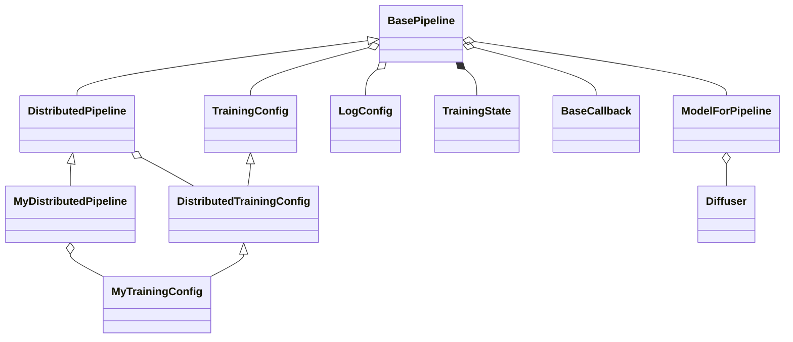
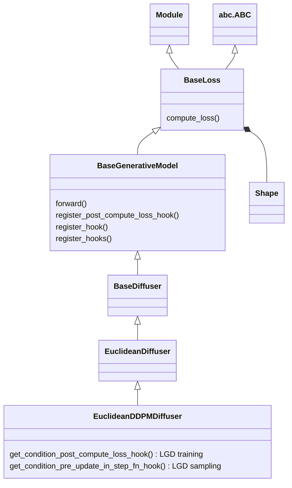

```mermaid
classDiagram
BasePipeline <|-- DistributedPipeline
DistributedPipeline  <|-- MyDistributedPipeline
BasePipeline o-- TrainingConfig
BasePipeline o-- LogConfig
BasePipeline *-- TrainingState
DistributedPipeline o-- DistributedTrainingConfig
TrainingConfig <|-- DistributedTrainingConfig
DistributedTrainingConfig <|--MyTrainingConfig
MyDistributedPipeline o-- MyTrainingConfig
BasePipeline o-- BaseCallback
BasePipeline o-- ModelForPipeline
ModelForPipeline o-- Diffuser
```

---

```mermaid
classDiagram
EuclideanDiffuser <|-- EuclideanDDPMDiffuser
BaseDiffuser <|-- EuclideanDiffuser
BaseGenerativeModel <|-- BaseDiffuser
BaseLoss <|-- BaseGenerativeModel
Module <|-- BaseLoss
abc.ABC <|-- BaseLoss
BaseLoss *-- Shape
BaseLoss: compute_loss()
BaseGenerativeModel: forward()
BaseGenerativeModel: register_post_compute_loss_hook()
BaseGenerativeModel: register_hook()
BaseGenerativeModel: register_hooks()
EuclideanDDPMDiffuser: get_condition_post_compute_loss_hook() LGD training
EuclideanDDPMDiffuser: get_condition_pre_update_in_step_fn_hook() LGD sampling
```
